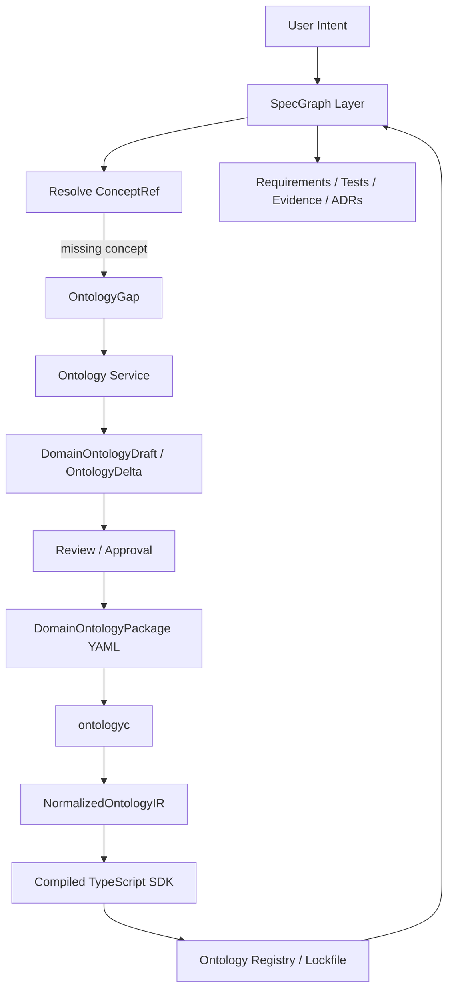

# PRD: ONT-001 — Ontology Layer and SpecGraph Semantic Import

**Status:** PRD Ready  
**Priority:** P0  
**Phase:** Foundation  
**Reasoning Effort:** high  
**Role Applied:** `SPECS/ROLES/Architect.md` — Specification Architect  
**Source Inputs:**
- `SPECS/raw/Агентная_Операционная_Система_-_Branch_SpecGraph_-_Онтологии.json`
- `SPECS/raw/Агентная_Операционная_Система_-_Branch_SpecGraph_-_Онтологии.html`

## TL;DR

Build a lower-level Ontology Layer that owns product/domain ontology packages, while SpecGraph consumes those packages as versioned semantic dependencies. The MVP must define the contracts for `DomainOntologyPackage`, `OntologyImport`, `ConceptRef`, `SemanticBinding`, `OntologyGap`, normalized compiler IR, and generated TypeScript semantic SDK artifacts.

The first golden domain is an exam-controlled calculator for university tablets. Its ontology must model `Exam`, `ExamPolicyProfile`, `CalculatorFunction`, `FunctionSet`, `ExamModeSession`, signed policies, denied-by-default capabilities, and audit requirements. SpecGraph must not redefine those domain concepts; it must import them and reference them from requirements, tests, policies, and evidence artifacts.

## Conceptual Checklist

- Separate `Ontology Service` from `SpecGraph Core`.
- Treat YAML ontology as declarative semantic source, never executable code.
- Compile ontology YAML into normalized IR before emitting TypeScript.
- Use TypeScript as a strict compiled semantic SDK: refs, types, relations, registry, validators.
- Require SpecGraph semantic references to resolve through imported ontology packages.
- Create `OntologyGap` instead of inventing local pseudo-concepts.
- Validate compatibility and lock ontology versions to prevent semantic drift.

## Objective

Create an implementation-ready specification for a reusable ontology system that lets product intents become governed domain ontology packages, then lets SpecGraph build engineering artifacts over those imported ontologies.

The raw conversation establishes four core decisions:

1. New product intent creates a candidate ontology draft, not trusted truth.
2. Existing product intent creates an ontology delta candidate.
3. Product ontology belongs below SpecGraph, in an Ontology Service / Registry layer.
4. SpecGraph imports compiled ontology packages and references canonical ontology concepts.

## Scope

### In Scope

- Normative Markdown/YAML/TypeScript-oriented specifications for ontology packages.
- A minimal `examcalc` ontology package example.
- A compiler contract for `ontologyc`: parse, validate, normalize, typecheck, emit.
- SpecGraph import and reference artifacts:
  - `OntologyImport`
  - `OntologyLockfile`
  - `ConceptRef`
  - `SemanticBinding`
  - `OntologyGap`
  - `OntologyDeltaRequest`
  - `OntologyCompatibilityReport`
- Validation rules and acceptance tests for the specification.
- Security constraints for untrusted YAML inputs.

### Out of Scope

- Building the actual calculator application.
- Building a production ontology registry service.
- Implementing a full graph database.
- Executing YAML expressions, hooks, plugins, or arbitrary code.
- Encoding real university legal policy as verified fact.
- Making SpecGraph own product/domain ontology internally.
- ABox/instance-level validation (concrete signed policy documents, instance Zod schemas) — deferred to a follow-up task.
- `SemanticTraceLink` artifact — follow-up; MVP traceability is carried by `SemanticBinding`.
- Mode C "Domain Reframing" intent flow — follow-up; MVP covers ProductCreation / Feature / Change intents.

## Target Platform and Assumptions

- Repository is currently documentation/specification-first.
- Future reference implementation target is TypeScript/Node.js unless overridden.
- YAML is the human-authored ontology source format.
- TypeScript is the initial compiled target for strict developer and agent consumption.
- JSON Schema is acceptable for machine-readable validation contracts.
- Domain ontology packages use semver-like versioning.
- The first domain example is `edu.university.examcalc@0.1.0`.

Reference standards and specs:

- [YAML 1.2.2](https://yaml.org/spec/1.2.2/)
- [JSON Schema 2020-12](https://json-schema.org/draft/2020-12/json-schema-core)
- [Semantic Versioning 2.0.0](https://semver.org/)
- [W3C DID Core](https://www.w3.org/TR/did-1.0/) for future signer/key reference design

## Problem Statement

SpecGraph needs domain-aware retrieval, requirements, tests, and evidence. If each requirement stores domain meaning as free text, the graph cannot reliably answer questions such as "what do we have for exam policy profiles?" or validate whether `examcalc:allows` correctly links a policy profile to calculator functions.

The product ontology must be a semantic dependency, similar to a typed package. SpecGraph must import it, pin a version, resolve canonical references, and reject unresolved or drifting concepts.

## Product Domain Frame

Initial user intent:

```text
Хочу сделать приложение-калькулятор для учебных планшетов в университете,
которым бы было разрешено пользоваться на экзаменах. При этом для разных
экзаменов должны быть разрешены разные наборы функций.
```

Architectural interpretation:

| Field | Value |
|---|---|
| Surface product | `CalculatorApplication` |
| Deep domain | `ExamControlledComputation` |
| Governing concept | `ExamPolicyProfile` |
| Primary value | Fair and controlled calculator use during exams |
| Primary risk | Student obtains unfair advantage through disallowed functions or external access |
| Criticality | High, because policy enforcement affects exam integrity |

Bounded contexts:

- `Calculation`
- `ExamPolicyManagement`
- `ExamModeRuntime`
- `DeviceTrust`
- `AuditAndCompliance`

## Architecture



Layer responsibilities:

| Layer | Owns | Must Not Own |
|---|---|---|
| Ontology Service | domain concepts, relations, policies, state machines, versions | engineering requirements, test execution evidence |
| `ontologyc` | validation, normalized IR, generated SDK artifacts | user intent interpretation, governance approval |
| SpecGraph | requirements, tests, evidence, decisions, semantic bindings | product/domain concept definitions |

## Deliverables

| ID | Deliverable | Output Path | Acceptance Criteria |
|---|---|---|---|
| D1 | Core contracts spec | `SPECS/ontology/core-contracts.md` | Defines `OntologyImport`, `ConceptRef`, `SemanticBinding`, `OntologyGap`, and lockfile behavior |
| D2 | Domain ontology package schema | `SPECS/ontology/domain-ontology-package.schema.yaml` | Validates metadata, imports, classes, protocols, relations, policies, state machines, compatibility |
| D3 | Foundation TypeScript model spec | `SPECS/ontology/foundation-types.md` | Defines `Actor`, `SystemActor`, `DomainEntity`, `ValueObject`, `Capability`, `Policy`, `Event`, `Command`, `Invariant`, `StateMachine`, protocols |
| D4 | Compiler IR spec | `SPECS/ontology/compiler-ir.md` | Defines normalized IR and required diagnostics |
| D5 | `ontologyc` compiler contract | `SPECS/ontology/ontologyc.md` | Defines CLI, pipeline, validations, and generated files |
| D6 | Exam calculator ontology example | `SPECS/ontology/examples/examcalc.ontology.yaml` | Contains required classes, relations, policies, state machine, and compatibility metadata |
| D7 | SpecGraph integration examples | `SPECS/ontology/examples/specgraph-semantic-binding.yaml` | Shows requirement/test/evidence references to `examcalc:*` concepts |
| D8 | Validation report template | `SPECS/ontology/validation-report-template.md` | Captures schema, relation, semanticRef, compatibility, security, and competency-question validation results |
| D9 | Terminology glossary | `SPECS/ontology/glossary.md` | Defines all core ontology and SpecGraph terms used across deliverables |
| D10 | Competency questions example | `SPECS/ontology/examples/examcalc.competency-questions.yaml` | Lists competency questions the `examcalc` ontology must answer, each mapped to concepts/relations |

## Functional Requirements

| ID | Requirement | Acceptance Criteria | Verification |
|---|---|---|---|
| FR-001 | A `DomainOntologyPackage` MUST declare `metadata.id`, `metadata.namespace`, and `metadata.version`. | Missing fields are validation errors. | Schema fixture with missing metadata fails. |
| FR-002 | Every ontology class MUST extend exactly one foundation class or imported class. | Multiple inheritance through `extends` is rejected. | Validator fixture rejects invalid class. |
| FR-003 | Ontology classes MAY implement zero or more protocols. | Protocol obligations are visible in generated TypeScript interfaces. | Golden generated `types.ts` includes protocol mixins. |
| FR-004 | Every relation MUST declare `domain`, `range`, and optional cardinality. | Unknown domain/range fails validation. | Relation validator tests. |
| FR-005 | SpecGraph artifacts MUST reference domain concepts only through resolvable `ConceptRef` values. | Free-text semantic refs are rejected. | `semanticRefs` fixture fails on unknown alias. |
| FR-006 | SpecGraph MUST create `OntologyGap` when required concept is missing. | Gap includes requested concept, source artifact, target ontology, and proposed action. | Missing concept fixture emits expected gap. |
| FR-007 | `ontologyc` MUST compile from normalized IR, not directly from raw YAML. | IR file exists and diagnostics are emitted before SDK generation. | Golden compile trace. |
| FR-008 | Generated SDK MUST include `refs.ts`, `types.ts`, `relations.ts`, `policies.ts`, `state-machines.ts`, `registry.ts`, validators, and normalized JSON. | All expected files are present. | File existence + snapshot tests. |
| FR-009 | Ontology updates MUST produce compatibility reports. | Breaking changes are classified as major-version changes. | Compatibility fixture tests. |
| FR-010 | User intent induction MUST output draft/delta candidates, never approved ontology directly. | Draft status is `candidate` or `draft`, not `approved`. | Prompt contract fixture. |

## Non-Functional Requirements

| Category | Requirement | Acceptance Criteria |
|---|---|---|
| Security | `ontologyc` MUST NOT execute YAML content, hooks, embedded expressions, or generated code during validation. | Static parser/validator only; malicious fixture cannot run shell commands. |
| Reproducibility | Same YAML input and compiler version MUST produce the same normalized IR and SDK output. | Golden snapshots are stable. |
| Auditability | Ontology packages MUST preserve source provenance and approval status. | Metadata includes source, publisher, approval, and version fields. |
| Compatibility | Patch/minor/major ontology changes MUST be classified deterministically. | Compatibility report explains each breaking or non-breaking change. |
| Retrieval quality | Domain concepts MUST become deterministic retrieval anchors for SpecGraph. | Query examples resolve through ontology refs, not keyword-only matching. |
| License safety | Third-party compiler/runtime dependencies MUST be license-reviewed before adoption. | GPL-like dependencies are explicitly documented or avoided. |

## Core Artifact Definitions

### DomainOntologyPackage

```yaml
apiVersion: ontology.specgraph.io/v1alpha1
kind: DomainOntologyPackage
metadata:
  id: edu.university.examcalc
  namespace: examcalc
  version: 0.1.0
  publisher: OntologyService
spec:
  imports:
    - id: specgraph.foundation
      version: 0.1.0
  classes: {}
  relations: {}
  policies: {}
  stateMachines: {}
```

### ConceptRef

`ConceptRef` is the canonical pointer used by SpecGraph and generated SDKs.

Required fields:

- `ontology`
- `version`
- `namespace`
- `concept`
- `kind`
- `uri`
- `alias`

Example alias:

```yaml
alias: examcalc:ExamPolicyProfile
uri: ontology://edu.university.examcalc/0.1.0/classes/ExamPolicyProfile
```

### SemanticBinding

`SemanticBinding` links a SpecGraph engineering artifact to imported domain concepts.

```yaml
apiVersion: specgraph.io/v1alpha1
kind: SemanticBinding
metadata:
  id: sb-req-001
spec:
  artifact:
    kind: Requirement
    id: REQ-001
  semanticRefs:
    - examcalc:ExamPolicyProfile
    - examcalc:CalculatorFunction
```

### OntologyGap

`OntologyGap` is created when SpecGraph needs a concept that is not present in imported ontologies.

```yaml
apiVersion: specgraph.io/v1alpha1
kind: OntologyGap
metadata:
  id: gap-001
spec:
  sourceArtifact:
    kind: Requirement
    id: REQ-001
  missingConcept: examcalc:CASFunction
  targetOntology: edu.university.examcalc
  action:
    type: proposeOntologyDelta
```

## Exam Calculator Golden Ontology

Required classes:

| Concept | Kind | Protocols | Rationale |
|---|---|---|---|
| `Exam` | `DomainEntity` | `Auditable` | Exam owns policy context. |
| `ExamSession` | `DomainEntity` | `TimeBound` | Runtime window for one exam sitting. |
| `TabletDevice` | `DomainEntity` | `DeviceBound`, `Auditable` | Managed device used during exam. |
| `CalculatorFunction` | `Capability` | `RestrictableCapability` | Function-level permission unit. |
| `FunctionSet` | `DomainEntity` | none | Named group of allowed/denied functions. |
| `ExamPolicyProfile` | `DomainEntity` | `Versioned`, `Approvable`, `Signable`, `Auditable`, `TimeBound` | Governing policy for allowed calculator behavior. |
| `ExamModeSession` | `DomainEntity` | `Auditable`, `DeviceBound` | Active enforced runtime mode. |
| `PolicyViolation` | `Event` | `Auditable` | Evidence of attempted or detected rule violation. |
| `AuditLogEntry` | `DomainEntity` | `Auditable` | Durable trace for review. |

Required relations:

| Relation | Domain | Range | Cardinality |
|---|---|---|---|
| `requires_policy` | `Exam` | `ExamPolicyProfile` | `1..1` |
| `has_session` | `Exam` | `ExamSession` | `0..*` |
| `allows` | `ExamPolicyProfile` | `CalculatorFunction` | `0..*` |
| `denies` | `ExamPolicyProfile` | `CalculatorFunction` | `0..*` |
| `includes_function` | `FunctionSet` | `CalculatorFunction` | `0..*` |
| `enforces` | `ExamModeSession` | `ExamPolicyProfile` | `1..1` |
| `occurred_during` | `PolicyViolation` | `ExamModeSession` | `1..1` |
| `records` | `AuditLogEntry` | `PolicyViolation` or `ExamModeSession` | `0..*` |

Required policies:

- `DenyByDefaultPolicy`: calculator functions are disabled unless explicitly allowed.
- `PolicyMustBeSigned`: an `ExamPolicyProfile` must be signed before activation.
- `PolicyMustBeDeviceVerifiable`: an `ExamModeSession` must verify the active policy on the device before entering `active`.
- `NoNetworkDuringExam`: network access is denied during exam mode unless explicitly allowed.

Required state machine:

- `ExamModeSessionState`
  - `not_started`
  - `pending_device_verification`
  - `active`
  - `violation_detected`
  - `locked`
  - `completed`
  - `failed`

Required transitions:

| From | To | Trigger |
|---|---|---|
| `not_started` | `pending_device_verification` | `StartExamMode` command |
| `pending_device_verification` | `active` | `VerifyDeviceAndPolicy` command |
| `active` | `violation_detected` | `PolicyViolation` event |
| `violation_detected` | `locked` | `LockCalculator` command |
| `active` | `completed` | `EndExamMode` command |

### Competency Questions (Ontology Validation)

Competency questions act as unit tests for the ontology: each MUST be answerable through defined concepts and relations. They are authored in `examcalc.competency-questions.yaml` (D10) and exercised by the validation report.

| Question | Concepts / Relations Exercised |
|---|---|
| Which calculator functions are allowed for a given exam? | `Exam`, `ExamPolicyProfile`, `CalculatorFunction`, `requires_policy`, `allows` |
| Which functions are explicitly denied for an exam? | `ExamPolicyProfile`, `CalculatorFunction`, `denies` |
| Can an `ExamModeSession` become `active` if the policy is unsigned or not device-verified? | `ExamModeSession`, `ExamPolicyProfile`, `PolicyMustBeSigned`, `PolicyMustBeDeviceVerifiable`, `enforces` |
| What evidence proves the correct policy was enforced during the exam? | `AuditLogEntry`, `ExamModeSession`, `PolicyViolation`, `records` |

A competency question that references an undefined concept MUST raise an `OntologyGap` instead of being silently unanswerable.

## Test-First Plan

| Test ID | Target | Input | Expected Result |
|---|---|---|---|
| T-001 | Schema validation | package without `metadata.version` | validation fails |
| T-002 | Class validation | class with two `extends` parents | validation fails |
| T-003 | Relation validation | `allows` range points to unknown class | validation fails |
| T-004 | Semantic reference resolution | requirement references `examcalc:ExamPolicyProfile` | resolver returns canonical URI |
| T-005 | Missing concept workflow | requirement references `examcalc:CASFunction` | emits `OntologyGap` |
| T-006 | Golden compile | `examcalc.ontology.yaml` | emits stable IR and SDK file list |
| T-007 | Security | YAML fixture includes shell-like expression | compiler treats it as inert data or rejects it |
| T-008 | Compatibility | relation range changes from `CalculatorFunction` to `FunctionSet` | report marks breaking change |
| T-009 | Competency questions | each question in `examcalc.competency-questions.yaml` | every referenced concept/relation resolves; unresolved reference emits `OntologyGap` |

## Hierarchical TODO Plan

| ID | Task | Inputs | Output | Priority | Effort | Dependencies | Parallelizable | Verification |
|---|---|---|---|---|---|---|---|---|
| 1.1 | Extract terminology glossary from raw plan | Raw JSON/HTML | `SPECS/ontology/glossary.md` | High | 2h | None | yes | Glossary covers all core terms. |
| 1.2 | Define layer boundary | Raw plan, Architect role | `core-contracts.md` | High | 3h | None | no | Boundary table names owners and non-owners. |
| 2.1 | Specify `DomainOntologyPackage` YAML | YAML spec, raw examples | schema YAML | High | 4h | 1.2 | yes | Valid/invalid fixtures listed. |
| 2.2 | Specify foundation meta-model | Raw meta-model | `foundation-types.md` | High | 4h | 1.2 | yes | Each concept kind has meaning and required fields. |
| 2.3 | Specify protocols | Raw protocol notes | `foundation-types.md` | High | 2h | 2.2 | yes | Protocol obligations are explicit. |
| 3.1 | Define normalized IR | Compiler notes | `compiler-ir.md` | High | 4h | 2.1, 2.2 | no | IR separates source YAML from generated SDK. |
| 3.2 | Define diagnostics model | Validator needs | `compiler-ir.md` | Medium | 2h | 3.1 | yes | Diagnostics include code, severity, path, message. |
| 4.1 | Specify `ontologyc check` | Compiler pipeline | `ontologyc.md` | High | 3h | 3.1 | no | CLI input/output/errors are deterministic. |
| 4.2 | Specify `ontologyc compile` | Compiler pipeline | `ontologyc.md` | High | 4h | 4.1 | no | Required generated files are listed. |
| 5.1 | Specify SpecGraph imports | Layer boundary | `core-contracts.md` | High | 3h | 2.1 | yes | `OntologyImport` and lockfile examples validate. |
| 5.2 | Specify semantic refs and bindings | Raw SemanticBinding notes | example YAML | High | 3h | 5.1 | yes | Requirement example resolves refs. |
| 5.3 | Specify ontology gap workflow | Raw gap workflow | `core-contracts.md` | High | 3h | 5.2 | no | Missing concept example produces delta request. |
| 6.1 | Author `examcalc` ontology | Golden domain frame | example YAML | High | 5h | 2.1, 2.2 | yes | Includes required classes, relations, policies, state machine. |
| 6.2 | Author SpecGraph examples over `examcalc` | `examcalc` ontology | binding/test examples | Medium | 3h | 6.1, 5.2 | yes | Examples do not duplicate domain definitions. |
| 6.3 | Author competency questions for `examcalc` | `examcalc` ontology | `examcalc.competency-questions.yaml` | Medium | 2h | 6.1 | yes | Every question resolves through defined concepts/relations. |
| 7.1 | Create validation report template | Tests and NFRs | report template | Medium | 2h | all core specs | yes | Template covers all test IDs. |
| 7.2 | Review for ambiguity | All outputs | revised specs | High | 2h | all outputs | no | No "TBD" remains in normative sections. |

## Roadmap

### Phase 1 — Core Contracts

Implementation: define layer boundaries and core artifacts.  
Verification: examples show SpecGraph importing ontology instead of owning domain concepts.  
Success metric: all required artifact names and responsibilities are defined in one place.

### Phase 2 — Ontology Package and Foundation Model

Implementation: specify YAML package schema, foundation classes, protocols, relations, policies, and state machines.  
Verification: `examcalc` can be expressed without ad hoc fields.  
Success metric: every golden concept maps to a foundation kind and optional protocol set.

### Phase 3 — Compiler Contract

Implementation: define `ontologyc` pipeline, normalized IR, diagnostics, generated SDK layout, and security constraints.  
Verification: golden compile trace can be checked manually or by snapshot tests later.  
Success metric: raw YAML is never used directly as SDK output source.

### Phase 4 — SpecGraph Integration

Implementation: define import, lockfile, reference resolution, `SemanticBinding`, and `OntologyGap`.  
Verification: requirements/tests/evidence examples resolve `examcalc:*` refs through imported registry.  
Success metric: missing concepts produce gaps, not local pseudo-concepts.

### Phase 5 — Validation and Governance

Implementation: define compatibility report, approval metadata, and validation report template.  
Verification: breaking and non-breaking ontology changes are classified.  
Success metric: semantic drift is detectable before SpecGraph accepts an ontology update.

## User Interaction Flows

### New Product Intent

1. User provides compact product intent.
2. SpecGraph classifies intent as `ProductCreationIntent`.
3. SpecGraph requests candidate ontology from Ontology Service.
4. Ontology Service emits `DomainOntologyDraft`.
5. Human or governance policy approves draft.
6. Ontology Service publishes `DomainOntologyPackage`.
7. SpecGraph imports package and creates requirements/tests/evidence with `semanticRefs`.

### Missing Concept During Specification

1. Author writes requirement referencing `examcalc:CASFunction`.
2. Resolver fails to find concept in imported `edu.university.examcalc@0.1.0`.
3. SpecGraph emits `OntologyGap`.
4. Ontology Service proposes `OntologyDelta`.
5. Governance approves and publishes `edu.university.examcalc@0.2.0`.
6. SpecGraph updates lockfile after compatibility check.

### Existing Product Change Intent

1. User requests a new capability or rule.
2. SpecGraph classifies intent as `FeatureIntent` or `ChangeIntent`.
3. Ontology Service proposes `OntologyDelta` against pinned base ontology.
4. SpecGraph waits for approved ontology version before adding canonical semantic refs.

## Edge Cases and Failure Scenarios

| Scenario | Expected Behavior |
|---|---|
| Ontology alias resolves to multiple concepts | Validation fails with ambiguous reference diagnostic. |
| Ontology version in lockfile differs from imported package | Compatibility check required before update. |
| Requirement contains free-text domain concept only | Validation warns or fails depending on strictness mode. |
| YAML contains executable-looking expression | Compiler rejects or treats as inert scalar; no execution allowed. |
| Ontology delta changes relation domain/range | Compatibility report marks breaking change. |
| User intent implies regulatory rule not stated by source | Candidate concept is marked `needsClarification`; not accepted as fact. |
| Generated TypeScript and registry disagree | Build fails; normalized IR remains source of truth. |

## Acceptance Criteria

- [ ] PRD outputs listed in Deliverables are created.
- [ ] `examcalc` ontology contains all required classes, relations, policies, and state machine.
- [ ] SpecGraph examples reference `examcalc:*` concepts through semantic refs only.
- [ ] `OntologyGap` workflow is documented with at least one missing concept example.
- [ ] Compiler contract states that YAML is untrusted and must not be executed.
- [ ] Compatibility rules classify patch, minor, and major ontology changes.
- [ ] Validation report template maps directly to T-001 through T-009.
- [ ] Competency questions for `examcalc` resolve through defined concepts and relations, or raise `OntologyGap`.
- [ ] Normative sections avoid vague terms such as "smart", "proper", or "reasonable" without measurable criteria.

## Risks and Mitigations

| Risk | Impact | Mitigation |
|---|---|---|
| Ontology inflation | Too many low-value concepts reduce retrieval precision. | Use ontology critic and hard reject noun-only drafts. |
| Semantic drift | Old requirements silently change meaning. | Pin lockfile and require compatibility reports. |
| Implementation leakage | UI or TS implementation details become domain model. | Require domain framing and governing concept review. |
| Unsafe YAML | Compiler or tooling executes malicious input. | Static parse/validate only; no hooks or expression eval. |
| Licensing conflict | Compiler dependencies introduce unwanted copyleft obligations. | Review dependency licenses before adoption. |
| Over-centralized SpecGraph | SpecGraph becomes domain ontology owner again. | Keep domain classes only in ontology package examples. |

## Notes for EXECUTE

- Start with documentation/spec files, not runtime implementation.
- Keep examples small but complete.
- Prefer normative `MUST`, `SHOULD`, `MAY` language in contract sections.
- Do not introduce actual executable compiler code unless a follow-up task explicitly requests implementation.
- Preserve raw source files as provenance for this PRD.

## Machine-Readable Execution Manifest

```yaml
task:
  id: ONT-001
  title: Ontology Layer and SpecGraph Semantic Import
  priority: P0
  status: PRD Ready
  source:
    - SPECS/raw/Агентная_Операционная_Система_-_Branch_SpecGraph_-_Онтологии.json
    - SPECS/raw/Агентная_Операционная_Система_-_Branch_SpecGraph_-_Онтологии.html
  deliverables:
    - SPECS/ontology/core-contracts.md
    - SPECS/ontology/domain-ontology-package.schema.yaml
    - SPECS/ontology/foundation-types.md
    - SPECS/ontology/compiler-ir.md
    - SPECS/ontology/ontologyc.md
    - SPECS/ontology/examples/examcalc.ontology.yaml
    - SPECS/ontology/examples/specgraph-semantic-binding.yaml
    - SPECS/ontology/validation-report-template.md
    - SPECS/ontology/glossary.md
    - SPECS/ontology/examples/examcalc.competency-questions.yaml
  validation:
    - T-001 metadata schema failure
    - T-002 invalid inheritance failure
    - T-003 invalid relation failure
    - T-004 semantic reference resolution
    - T-005 ontology gap emission
    - T-006 golden compile file list
    - T-007 untrusted YAML safety
    - T-008 compatibility classification
    - T-009 competency question resolution
```

---
**Archived:** 2026-06-01  
**Verdict:** PASS
